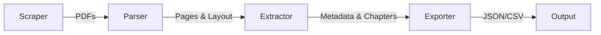

# Approach & Architecture

## Problem Statement
The goal is to design an automated pipeline that can:
1.  **Scrape** the latest CBSE/ICSE PDF textbooks from official sources.
2.  **Parse** the downloaded PDFs, handling both text-based and scanned files.
3.  **Extract** structured data:
    -   Chapter names and numbers
    -   Page ranges
    -   Metadata (Subject, Class, Board)
4.  **Output** clean, structured data (JSON/CSV).

## Architecture Overview

The system follows a linear pipeline architecture:

### 1. Scraper Layer
-   **Discovery**: Generates URLs based on board-specific patterns (NCERT/CISCE).
-   **Download**: Fetches PDFs with retry logic and polite delays.
-   **Storage**: Organizes files in a directory structure: `data/pdfs/{board}/{class}/{subject}/{filename}.pdf`.

### 2. Parser Layer
The parser employs a **hybrid approach** to handle diverse PDF qualities:
-   **Text-Based PDFs**: Uses `pdfplumber` to extract text, character coordinates, and layout information.
-   **Scanned PDFs**: Automatically detects scanned pages (low text density) and applies **OCR (Tesseract)** to extract text.
-   **Layout Analysis**: Preserves character-level positioning (`x0`, `top`, `size`) to enable font-size based heuristics.

### 3. Extraction Layer
This is the core intelligence of the pipeline, using multiple strategies to structure the unstructured text.

#### Metadata Extraction
-   **Path-Based**: Infers Board, Class, and Subject from the file path.
-   **Content-Based**: Scans the first few pages for keywords (e.g., "Class X", "Mathematics") to fill gaps.

#### Chapter Detection Engine
We use a multi-strategy approach to identify chapters:
-   **Strategy A: Font Size Analysis**:
    -   Calculates statistical distribution of font sizes across the document.
    -   Identifies lines with font sizes significantly larger than the mean (Threshold = Mean + StdDev).
    -   Filters out noise (e.g., "Index", "Bibliography").
-   **Strategy B: Regex Patterns**:
    -   Matches standard patterns like `Chapter \d+`, `Unit \d+`, `Lesson \d+`.
    -   Supports multi-lingual patterns (Hindi, Tamil, Kannada).
-   **Strategy C: Table of Contents (ToC)**:
    -   (Planned) Parses the ToC page to map chapter names to page numbers.

#### Merger
-   Combines results from all strategies to produce a high-confidence list of chapters with start and end page numbers.

### 4. Exporter Layer
-   **JSON**: Full hierarchical structure.
-   **CSV**: Flat table for easy analysis.
-   **Master Index**: Updates a central registry of all processed books.

## Challenges & Solutions

| Challenge | Solution |
| :--- | :--- |
| **Scanned PDFs** | Integrated Tesseract OCR with automatic detection of scanned pages. |
| **No Standard Structure** | Used statistical font analysis instead of fixed rules. |
| **Incomplete Metadata** | Fallback to content scanning if file path is ambiguous. |
| **Network Flakiness** | Implemented exponential backoff and retries in the scraper. |

## Future Improvements
-   **Deep Learning for Layout**: Replace heuristics with a Vision Transformer (LayoutLM) for better accuracy on complex pages.
-   **Cross-Reference Validation**: Verify extracted page numbers against the actual page content.
